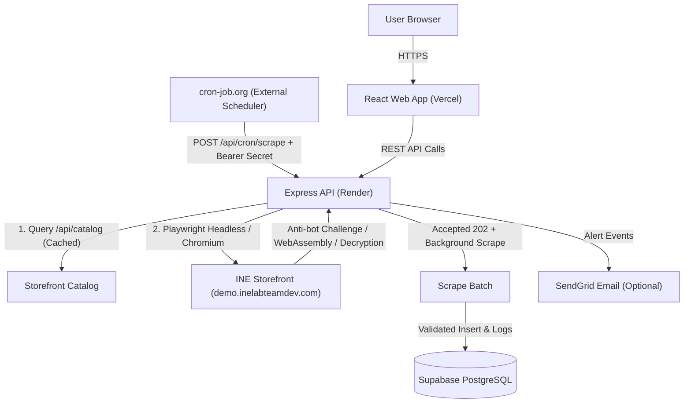

# Architectural Design & Scraping Reliability Note

## 1. Overview & Architecture

The INE Product Price Tracker is a full-stack monitoring system designed specifically to track product pricing and inventory changes on the INE mock storefront (`https://demo.inelabteamdev.com/`).

The system consists of four decoupled layers:

1. **Frontend**: React (Vite) single-page application deployed to **Vercel**. Provides live debounced product search, product tracking, configurable scrape frequency, metrics dashboard, price trend visualization, structure-change status, and transparent per-attempt observability logs.

2. **Backend API**: Node.js (Express) REST service deployed to **Render**. Exposes endpoints for catalog search, tracking management, manual scraping, and authenticated cron triggers.

3. **Database**: Managed PostgreSQL hosted on **Supabase** via `@supabase/supabase-js`, with tables for `tracked_products`, `price_history`, and `scrape_logs`, protected with cascade constraints and Row Level Security.

4. **External Scheduler**: A trigger configured on **cron-job.org** calling `POST /api/cron/scrape` with Bearer token authentication. The endpoint acknowledges the request immediately with HTTP 202 and starts the scrape batch in the background, avoiding cron-job timeouts while the Render service performs the actual work.



---

## 2. Scraping Strategy: Playwright vs. Lightweight HTTP

The core evaluation criterion is **scraping reliability** against an intentionally adversarial storefront.

### Lightweight HTTP-First Layer

Where static HTML or structured data is genuinely present (e.g. standard JSON-LD, metadata), a fast HTTP `fetch()` with Cheerio parsing is executed first.

- If all required fields (`name`, `price`, `stock`, `currency`) pass strict schema validation, the scrape succeeds in under 200ms without spinning up a browser instance.
- However, on the real INE mock store, prices are intentionally omitted from initial server HTML and product listing pages (`<div id="root"></div>` client-rendered SPA).

### Playwright Automation Layer

When lightweight HTTP extraction cannot yield a valid, confirmed price, the system transitions to Playwright with Chromium. Playwright is required because:

1. **Hidden-Price State**: The store hides the price behind a `"Price hidden"` element and `"Reveal price"` button that is initially disabled.

2. **Human-like Mouse Dwell Interaction**: The store's JavaScript requires tracking at least 8 mouse movements spaced by ≥40ms with a total dwell time exceeding 600ms before unlocking the `"Reveal price"` control.

3. **Adversarial Click Handling**: The store wraps button callbacks in `Xn()`, which randomly discards 17.5% of clicks and delays others by 900ms. Playwright monitors DOM state transitions and re-clicks if the action was dropped.

4. **Disruptive Popups**: The store injects an asynchronous cookie modal (`.cookie-overlay`) that locks `body` scroll and intercepts pointer events. The scraper injects styles to disable overlays and restore pointer events.

5. **Decoy Element Trap**: The store can inject hidden/decoy price values, including elements marked `aria-hidden="true"` or hidden by CSS. The scraper checks computed visibility and prefers the visible `[data-price="true"]` element inside the price block, with a currency-symbol fallback restricted to the price block. This prevents unrelated numbers such as retry counts or MRP text from being recorded as the selling price.

---

## 3. Tracking Frequency & Structure-Change Detection

Each tracked product stores its own scrape interval. The supported frequencies are **2 hours, 4 hours, 6 hours, 12 hours, and 24 hours**. The frontend exposes this setting per tracked product and the backend validates the value before persisting it.

The cron worker does not blindly scrape every tracked product on every scheduler invocation. For each enabled product it calculates whether the product is due from `last_scraped_at + scrape_interval_minutes`. Products that are not due are skipped and included in the cron summary. This allows a single external scheduler to support different product frequencies without creating separate cron jobs.

The scraper also records a normalized **structure signature** for the price/stock DOM. When a successful scrape produces a different signature from the previous successful scrape, the product is marked with `structure_changed` and `structure_changed_at`, and the successful scrape log records `STORE_STRUCTURE_CHANGED`. The change is informational: the scrape is still considered successful only when valid price and stock data were extracted. A later stable scrape clears the current `structure_changed` flag while retaining the timestamp of the last detected change.

---

## 4. Challenge Handling, Timeouts & Bounded Retries

### The Intentional Challenge Failure State

On the real INE store, certain requests encounter an intentional challenge failure or upstream rate-limit:

- `"Couldn't load the price after 1 attempts."`
- `"challenge_failed"`
- `"upstream 429"` / `"upstream_error"`
- `"TRY AGAIN"` button

**Crucial Policy**: The scraper **never** interprets a challenge failure as price = 0, price = null, or stock = unknown. A failure remains an honest failure.

### Bounded Retries Policy

- **Maximum Attempts**: 3 attempts per scrape cycle (configurable via `SCRAPER_MAX_ATTEMPTS`).
- **Backoff Delay**: Jittered exponential backoff (`1000ms * 2^(attempt-1) + jitter`) between retry attempts to respect upstream rate limits.
- **In-Page vs. Process Retry**: The store's client component exhibits an internal 6-attempt retry loop (`jr = 6`). The scraper detects if the page is actively retrying (`"Retrying (attempt ...)"`) and allows it to complete before declaring an attempt failed. If a `"Try again"` button appears, it triggers an immediate re-attempt.
- **Attempt Logging**: Every attempt is recorded in `scrape_logs` with attempt number, duration, HTTP status code, and an honest status (`'success'`, `'retried'`, or `'failed'`). Previous retries are never retroactively disguised as successes.

---

## 5. Preventing Corrupted Data & Validation Rules

Before any row is written to `price_history` or updated in `tracked_products`, the payload must satisfy `assertValid`:

1. **Origin Verification**: Target URL must belong strictly to `https://demo.inelabteamdev.com/`. Third-party URLs are rejected with HTTP 400.
2. **Product Name**: Must be a non-empty string (≥2 characters).
3. **Numeric Price**: Must be a finite positive number (`price > 0 && price < 1e9`). Values parsed as NaN, 0, or negative are immediately rejected.
4. **Currency**: Extracted from quote or currency symbol (`INR`, `EUR`, `USD`, `GBP`).
5. **Stock Status**: Must be non-empty and reflect real inventory (`"IN STOCK · 200 LEFT"`, `"out_of_stock"`).
6. **Protection of Historical State**: If an attempt fails, **no row** is inserted into `price_history`, and the `last_price` on `tracked_products` remains untouched.

---

## 6. Scheduling, Concurrency & Render Sleeping

- **Why Not `setInterval`?**: Free and low-tier container instances on Render sleep after periods of inactivity. An in-process `setInterval` stops firing once the instance sleeps.
- **Production Architecture**: An external scheduler (**cron-job.org**) issues a periodic HTTP request every 2 hours:

  ```http
  POST /api/cron/scrape HTTP/1.1
  Host: YOUR-RENDER-SERVICE.onrender.com
  Authorization: Bearer <CRON_SECRET>
  Content-Type: application/json
  ```

  The incoming HTTP request wakes the Render instance, triggers the scraping batch, and receives a JSON summary report.

- **Concurrency Guard**: The cron handler processes tracked products in bounded batches (`SCRAPER_CONCURRENCY`, default 2) using an in-memory `Set` mutex (`running`) to prevent duplicate simultaneous runs on the same product ID.

---

## 7. AI-Assisted Development: Initial Mistakes and Corrections

In full transparency, early iterations of this codebase made several flawed assumptions about the storefront. Below is an honest audit of those mistakes and the exact corrections implemented after inspecting the live store DOM:

1. **Flawed Assumption: Server-Rendered Listing & Standard Search Input**
   - *Initial Mistake*: The original `discoverProducts` looked for HTML `<input>` tags and `a[href]` links in the homepage markup. It assumed the store had a traditional search form and server-rendered product links.
   - *Reality on Real Store*: The homepage is a React SPA with a single header anchor tag and zero `<input>` elements in the initial HTML. As a result, searching for `"shoe"` or `"shirt"` yielded `[]`.
   - *Correction*: Discovered the store's paginated REST catalog API (`/api/catalog?pageSize=60`). Built an in-memory cached search index (`catalog.js`) that indexes all 1,000 products, supports case-insensitive multi-token matching, and handles upstream 429 rate-limiting with `retryAfter` backoff.

2. **Flawed Assumption: Naive Selectors & Static Price Presence**
   - *Initial Mistake*: The original Playwright scraper simply navigated to the product URL and immediately executed `extractFromHtml(await page.content())`, expecting a static price.
   - *Reality on Real Store*: The store deliberately hides the price behind `"Price hidden"`, requiring real cursor movement over the price area for >600ms to enable the `"Reveal price"` button.
   - *Correction*: Implemented realistic cursor movement tracking (`page.mouse.move`) simulating human dwell times and path movements over `.price-block`, followed by clicking `"Reveal price"`.

3. **Flawed Assumption: Blindly Trusting `[data-price]` and `.price-value`**
   - *Initial Mistake*: The parser gave high scoring weight to elements matching `[data-price]` or `.price-value`.
   - *Reality on Real Store*: The store intentionally injects fake decoy prices into `<span class="price-value" aria-hidden="true" style="display:none">` and `<span class="amount" data-price="true" aria-hidden="true" style="display:none">` specifically to fool naive scrapers.
   - *Correction*: Explicitly filtered out all `aria-hidden="true"` and `data-price="true"` elements, isolating solely the visible computed font-size primary price element.

4. **Flawed Assumption: Simple Comma vs. Dot Decimal Splitting**
   - *Initial Mistake*: The parser assumed that if a comma appeared after a dot, the comma was a decimal separator (`comma > dot`).
   - *Reality on Real Store*: The store displays prices like `"₹14,794"`, where the comma is a thousands separator without any dot. The old logic converted `"₹14,794"` to `14.79`!
   - *Correction*: Rebuilt `parsePrice` to evaluate digit grouping lengths (e.g. 3 digits after comma = thousands separator, 2 digits = decimal separator), accurately handling Indian, European, and US currency formats.

5. **Flawed Assumption: Unsynchronized Client Clock**
   - *Initial Mistake*: Challenges submitted by Playwright were failing with HTTP 401 `"unauthorized"`.
   - *Reality on Real Store*: The store's anti-bot challenge issues a timestamp (`ts`) and verifies that client mouse events match the server's time within strict bounds. Because local VM clocks can drift from the mock store server's clock, the server rejected requests.
   - *Correction*: Added an initialization script (`context.addInitScript`) that computes the exact time offset from `/api/challenge` and aligns `Date.now()` within the browser environment.

6. **Flawed Assumption: Unchecked Modal Overlay Interceptions**
   - *Initial Mistake*: Playwright click actions timed out after 30 seconds.
   - *Reality on Real Store*: An adversarial cookie consent modal (`.cookie-overlay`) randomly spawns with a delay and blocks pointer events.
   - *Correction*: Added automatic CSS overrides (`.cookie-overlay { display: none !important; pointer-events: none !important; }`) and restored `body.overflow = 'auto'`.

---

## 8. Trade-offs & Known Limitations

1. **Headless Browser Overhead**: Running Playwright Chromium consumes more CPU and RAM than pure HTTP parsing. However, because the INE mock store utilizes WebAssembly and dynamic DOM challenges, headless browser execution is genuinely necessary.

2. **In-Memory Concurrency Lock**: In-memory mutexes prevent concurrent scrapes on a single Render instance. In a multi-replica clustered production setup, distributed Redis locks or PostgreSQL advisory locks would be preferred.

3. **Catalog Cache Refresh**: The catalog cache refreshes once every hour. New products added between refresh cycles will be discovered on the subsequent cycle or upon server restart.

4. **Background Cron Execution**: Returning HTTP 202 quickly prevents external scheduler timeouts, but background work is still tied to the lifetime of the Render process. A process restart can interrupt an active batch. A durable queue/worker architecture would remove this limitation.

5. **Optional Alert Delivery**: Email alerts depend on SendGrid connectivity and verified sender configuration. An unavailable email provider does not invalidate the underlying scrape, so alert delivery should be treated as an auxiliary notification channel rather than the source of truth.

6. **Structure Detection Is Advisory**: A structure signature is a compact diagnostic fingerprint, not a full semantic DOM diff. A detected change means the relevant extraction structure differs from the previous successful scrape; it does not by itself mean that scraping has failed.
