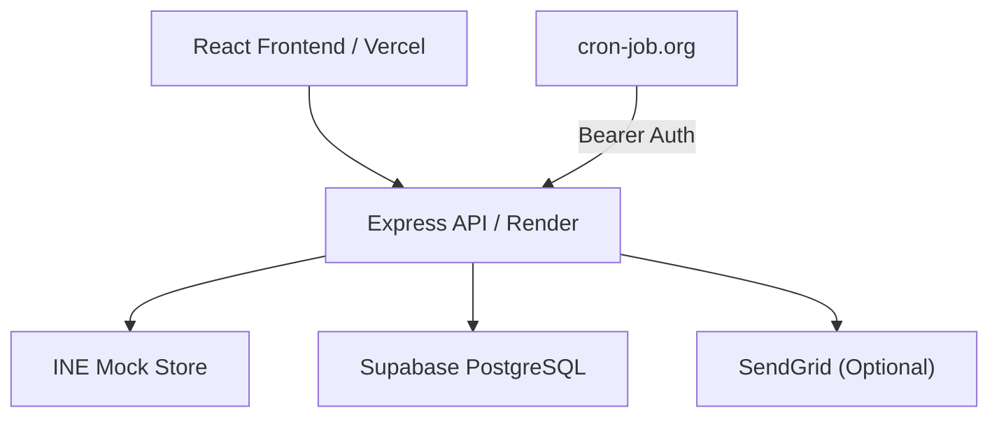

# INE Product Price & Stock Tracker

Full-stack product price and stock tracker built for the INE mock storefront:

https://demo.inelabteamdev.com/

The application searches products, tracks selected products, periodically scrapes price/stock, stores historical data, records scrape diagnostics, detects page-structure changes, and supports optional email alerts.

## Tech Stack

- **Frontend:** React + Vite
- **Backend:** Node.js + Express
- **Scraping:** Playwright Chromium + Cheerio
- **Database:** Supabase PostgreSQL
- **Frontend Hosting:** Vercel
- **Backend Hosting:** Render
- **Scheduler:** cron-job.org
- **Optional Alerts:** SendGrid

## Architecture



## Features

- Product search by partial or full name
- Product tracking and removal
- Current price and stock tracking
- Historical price/stock records
- Detailed scrape attempt logs
- Hidden-price challenge handling
- Human-like mouse movement and dwell interaction
- Retry handling for transient failures
- Strict price and stock validation
- Protection against hidden/decoy price values
- Failed scrapes never overwrite the last known good price
- Headed Chromium scraper for demonstration
- Configurable scrape frequency:
  - Every 2 hours
  - Every 4 hours
  - Every 6 hours
  - Every 12 hours
  - Every 24 hours
- Automatic structure-change detection
- Optional price-drop alerts
- Optional back-in-stock alerts

## Scraping Reliability

The scraper uses a layered approach:

```text
HTTP / Cheerio
      ↓
Strict validation
      ↓
Playwright fallback
      ↓
Hidden-price interaction
      ↓
Reveal price
      ↓
Visible DOM extraction
      ↓
Retry / challenge handling
      ↓
Final validation
      ↓
Database update
```

The scraper never treats a challenge failure or missing price as a valid result.

A failed scrape:

- is logged;
- does not create invalid price history;
- does not overwrite the previous valid price.

The scraper also records a structure signature for relevant price/stock elements. If the structure changes between successful scrapes, the product is marked with `structure_changed` and the event is logged.

## Local Setup

### Requirements

- Node.js 20+
- npm
- Chromium supported by Playwright
- Supabase project

### Backend

```bash
cd backend
npm install
npx playwright install --with-deps chromium
cp .env.example .env
```

Configure the backend `.env`:

```env
PORT=10000

SUPABASE_URL=https://YOUR_PROJECT_ID.supabase.co
SUPABASE_SERVICE_ROLE_KEY=YOUR_SERVICE_ROLE_KEY

STORE_BASE_URL=https://demo.inelabteamdev.com

CRON_SECRET=YOUR_CRON_SECRET

SCRAPER_TIMEOUT_MS=30000
SCRAPER_MAX_ATTEMPTS=3
SCRAPER_CONCURRENCY=2

SENDGRID_API_KEY=YOUR_SENDGRID_API_KEY
ALERT_FROM_EMAIL=YOUR_VERIFIED_SENDER
ALERT_TO_EMAIL=YOUR_ALERT_EMAIL
```

SendGrid variables are optional.

### Frontend

```bash
cd frontend
npm install
cp .env.example .env
```

Set:

```env
VITE_API_BASE_URL=http://localhost:10000
```

## Database Setup

Run:

```text
backend/sql/schema.sql
```

in the Supabase SQL Editor.

The database contains:

- `tracked_products`
- `price_history`
- `scrape_logs`

`tracked_products` also stores:

- `scrape_enabled`
- `scrape_interval_minutes`
- `structure_signature`
- `structure_changed`
- `structure_changed_at`

## Run Locally

### Backend

```bash
cd backend
npm run dev
```

Runs on:

```text
http://localhost:10000
```

### Frontend

```bash
cd frontend
npm run dev
```

Runs on:

```text
http://localhost:5173
```

## Tests

Backend tests:

```bash
cd backend
npm test
```

Frontend production build:

```bash
cd frontend
npm run build
```

## Headed Scraper

Run the visible Chromium scraper:

```bash
cd backend
npm run scrape:headed -- "https://demo.inelabteamdev.com/product/593"
```

The headed scraper demonstrates the real product-page interaction, including hidden price handling, mouse movement, reveal interaction, retries, and final extraction.

### Demonstration: transient failure

```bash
DEMO_FAIL_ONCE=1 npm run scrape:headed -- "https://demo.inelabteamdev.com/product/505"
```

### Demonstration: delayed response

```bash
DEMO_DELAY_MS=3000 npm run scrape:headed -- "https://demo.inelabteamdev.com/product/1000"
```

## API

| Method | Endpoint                      | Description                                |
| ------ | ------------------------------ | ------------------------------------------- |
| GET    | `/api/health`                  | Health check                                |
| GET    | `/api/products/search?q=shoe`  | Search products                             |
| GET    | `/api/tracked`                 | List tracked products                       |
| POST   | `/api/tracked`                 | Track a product and perform initial scrape  |
| DELETE | `/api/tracked/:id`             | Remove tracked product                      |
| GET    | `/api/tracked/:id/history`     | Get price/stock history                     |
| GET    | `/api/tracked/:id/logs`        | Get scrape logs                             |
| POST   | `/api/tracked/:id/scrape`      | Manual scrape                               |
| PATCH  | `/api/tracked/:id/frequency`   | Change scrape frequency                     |
| POST   | `/api/cron/scrape`             | Start scheduled scrape                      |

Cron authentication:

```http
Authorization: Bearer <CRON_SECRET>
```

## Scheduled Scraping

Render free-tier services can sleep, so scraping is triggered externally using cron-job.org.

Recommended schedule:

```text
Every 2 hours
```

Request:

```http
POST /api/cron/scrape
Authorization: Bearer <CRON_SECRET>
Content-Type: application/json
```

The endpoint returns `202 Accepted` immediately and starts the scraping batch in the background.

The worker then:

1. Finds enabled tracked products.
2. Checks each product's configured scrape interval.
3. Skips products that are not due.
4. Scrapes due products in bounded batches.
5. Stores successful history.
6. Records scrape logs.
7. Detects structure changes.
8. Sends optional alerts.

## Configurable Frequency

Supported values:

| Minutes | Frequency |
| ------: | --------- |
|     120 | 2 hours   |
|     240 | 4 hours   |
|     360 | 6 hours   |
|     720 | 12 hours  |
|    1440 | 24 hours  |

Example:

```http
PATCH /api/tracked/<id>/frequency
Content-Type: application/json
```

```json
{
  "scrape_interval_minutes": 240
}
```

## Optional Email Alerts

When SendGrid is configured, the backend can send alerts for:

- price drops;
- products returning to stock.

Email failures do not invalidate successful scrapes.

The database remains the source of truth.

## Deployment

### Render Backend

- Root directory: `backend`
- Runtime: Node
- Build:

```bash
npm ci && npx playwright install --with-deps chromium
```

- Start:

```bash
npm start
```

Configure the backend environment variables in Render.

### Vercel Frontend

- Root directory: `frontend`
- Framework: Vite

Set:

```env
VITE_API_BASE_URL=https://YOUR-RENDER-SERVICE.onrender.com
```

## Security

- Supabase service-role key is backend-only.
- `CRON_SECRET` is backend-only.
- SendGrid API key is backend-only.
- Frontend never receives backend secrets.
- Product URLs are restricted to `demo.inelabteamdev.com`.
- Cron requests require Bearer authentication.
- `.env` files must never be committed.

## Project Structure

```text
ine-price-tracker-fixed/
├── backend/
│   ├── scripts/
│   │   └── headed-run.js
│   ├── sql/
│   │   └── schema.sql
│   ├── src/
│   │   ├── catalog.js
│   │   ├── config.js
│   │   ├── db.js
│   │   ├── scraper.js
│   │   └── server.js
│   └── test/
│       └── scraper.test.js
│
├── frontend/
│   └── src/
│       ├── api.js
│       ├── main.jsx
│       └── styles/
│
├── docs/
│   ├── design-note.md
│   └── recording-script.md
│
├── DESIGN_NOTE.md
├── README.md
├── render.yaml
└── vercel.json
```

## Design Note

Detailed architecture, scraping decisions, reliability trade-offs, and AI-assisted development corrections are documented separately in:

```text
DESIGN_NOTE.md
```

## Submission

- **Live App:** `<VERCEL_URL>`
- **Backend:** `<RENDER_URL>`
- **GitHub:** `<GITHUB_REPOSITORY_URL>`
- **Recording:** `<RECORDING_URL>`
- **Design Note:** `DESIGN_NOTE.md`
