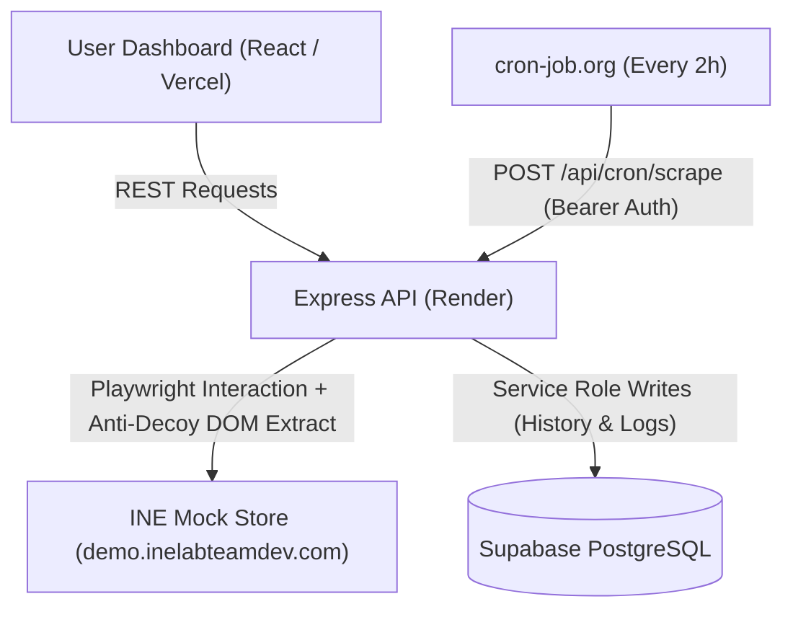

# INE Product Price & Stock Tracker

A production-grade, full-stack price tracking and scraping system designed specifically for the official INE mock storefront (`https://demo.inelabteamdev.com/`).

---

## 1. Project Overview & Architecture

The application monitors products on the INE mock store, overcomes intentionally adversarial anti-scraping challenges (hidden prices, human dwell verification, dropped click events, decoy elements), and maintains timestamped historical records with transparent diagnostic logs.

- **Frontend**: React (Vite) Single Page Application deployed to **Vercel**.
- **Backend API**: Node.js + Express REST API deployed to **Render**.
- **Database**: PostgreSQL hosted on **Supabase** via `@supabase/supabase-js`.
- **Scraper Engine**: Playwright Chromium + Cheerio with layered HTTP/browser extraction, hover/dwell challenge solver, and bounded retries.
- **Scheduler**: Protected cron endpoint triggered every 2 hours via **cron-job.org**.



---

## 2. Key Features

- **Product Discovery & Instant Search**: In-memory catalog index of all 1,000 storefront products. Supports partial names, full names, case-insensitive tokens, brands, and SKUs.
- **Adversarial Challenge Solver**: Overcomes the store's `"Price hidden"` state by simulating realistic human mouse movements and dwell times (>600ms) to unlock the `"Reveal price"` button.
- **Anti-Decoy Protection**: Ignores deceptive decoy numbers placed by the store in `aria-hidden="true"` and `data-price="true"` elements, isolating solely the true visible selling price.
- **Honest Observability**: Records every scrape attempt in `scrape_logs` (`success`, `retried`, `failed`), ensuring temporary challenge errors are never hidden or prematurely declared successful.
- **Data Integrity**: Enforces strict schema validation (`assertValid`). A failed scrape never corrupts the database or overwrites the last-known good price.
- **Headed Scraper Mode**: Command-line demonstration tool (`npm run scrape:headed`) that launches visible Chromium with structured terminal output.
- **In-App Bonus Alerts**: Automatically detects price drops (e.g., "Price dropped by 15%!") and inventory restoration ("Back in stock!").

---

## 3. Node & Environment Requirements

- **Node.js**: `v20.0.0` or higher (tested on Node v20.20.2).
- **npm**: `v10.0.0` or higher.

---

## 4. Environment Variables

### Backend (`backend/.env`)
```env
PORT=10000
SUPABASE_URL=https://YOUR_PROJECT_ID.supabase.co
SUPABASE_SERVICE_ROLE_KEY=YOUR_SUPABASE_SERVICE_ROLE_KEY
STORE_BASE_URL=https://demo.inelabteamdev.com
CRON_SECRET=your-strong-random-cron-secret
SCRAPER_TIMEOUT_MS=30000
SCRAPER_MAX_ATTEMPTS=3
SCRAPER_CONCURRENCY=2
```
> **Note**: Do not append `/rest/v1` to `SUPABASE_URL`; the client adds this path automatically.

### Frontend (`frontend/.env`)
```env
VITE_API_BASE_URL=http://localhost:10000
```
*(In production on Vercel, set `VITE_API_BASE_URL` to your Render API URL, e.g., `https://ine-price-tracker-api.onrender.com`)*

---

## 5. Local Setup & Installation

### Step 1: Clone Repository
```bash
git clone <repository-url>
cd ine-price-tracker-fixed
```

### Step 2: Install Backend Dependencies & Playwright
```bash
cd backend
npm install
npx playwright install --with-deps chromium
cp .env.example .env
# Edit .env with your Supabase credentials and CRON_SECRET
```

### Step 3: Install Frontend Dependencies
```bash
cd ../frontend
npm install
cp .env.example .env
```

---

## 6. Supabase Database Setup

1. Create a project at [supabase.com](https://supabase.com/).
2. Open the **SQL Editor** in the Supabase Dashboard.
3. Paste and run the contents of [`backend/sql/schema.sql`](file:///home/ritikajain/Documents/ine-price-tracker-fixed/backend/sql/schema.sql):
   - Creates `tracked_products` table with unique constraint on `source_url`.
   - Creates `price_history` table referencing `tracked_products(id)` with cascade delete.
   - Creates `scrape_logs` table recording all attempts.
   - Applies performance indexes and timestamp triggers.
4. Obtain your **Project URL** and **service_role secret key** from **Project Settings → API**.

---

## 7. Running Development Servers

### Terminal 1: Start Backend API
```bash
cd backend
npm run dev
```
*API will run at `http://localhost:10000` and pre-warm the product catalog index.*

### Terminal 2: Start Frontend Web App
```bash
cd frontend
npm run dev
```
*Web dashboard will be available at `http://localhost:5173`.*

---

## 8. Running Automated Tests

Run the backend test suite:
```bash
cd backend
npm test
```
Validates:
- Multi-currency price parsing (Indian thousands separator, European comma decimals, US decimals, unicode numerals).
- Stock status normalization.
- Strict store origin URL validation (rejecting external retailers).
- Strict schema validation rejecting NaN, zero, or corrupt prices.
- Structured JSON-LD extraction.

---

## 9. Running Headed Scraper (Demonstration)

To see the scraper visibly launch Chromium, navigate to the product, hover over the price area to unlock the button, handle challenges, and extract live data:

```bash
cd backend
npm run scrape:headed -- "https://demo.inelabteamdev.com/product/985"
```

### Demonstration Modes:
- **Simulate Transient Navigation Failure & Auto-Recovery**:
  ```bash
  DEMO_FAIL_ONCE=1 npm run scrape:headed -- "https://demo.inelabteamdev.com/product/505"
  ```
- **Simulate Network Delay**:
  ```bash
  DEMO_DELAY_MS=3000 npm run scrape:headed -- "https://demo.inelabteamdev.com/product/1000"
  ```

---

## 10. API Specification

| Method | Endpoint | Description | Auth |
|---|---|---|---|
| `GET` | `/api/health` | Service health status | None |
| `GET` | `/api/products/search?q=shoe` | Search store catalog by partial/full name | None |
| `GET` | `/api/tracked` | List all tracked products | None |
| `POST` | `/api/tracked` | Track a product & perform initial scrape | None |
| `DELETE` | `/api/tracked/:id` | Remove product, price history, & logs | None |
| `GET` | `/api/tracked/:id/history` | Historical price & stock records | None |
| `GET` | `/api/tracked/:id/logs` | Scrape attempt diagnostics | None |
| `POST` | `/api/tracked/:id/scrape` | Trigger on-demand manual scrape | None |
| `POST` | `/api/cron/scrape` | Scheduled batch scrape of enabled products | `Bearer <CRON_SECRET>` |

---

## 11. Scheduled 2-Hour Scraping (cron-job.org)

Free-tier container platforms like Render put services to sleep when idle. Therefore, **do not** use an in-process `setInterval`. Use an external webhook trigger:

1. Sign up for a free account at [cron-job.org](https://cron-job.org/).
2. Click **Create Cronjob**.
3. **URL**: `https://YOUR-RENDER-SERVICE.onrender.com/api/cron/scrape`
4. **Execution Schedule**: `Every 2 hours` (`0 */2 * * *`).
5. **Request Method**: `POST`
6. **Headers**:
   ```text
   Authorization: Bearer YOUR_CRON_SECRET
   Content-Type: application/json
   ```
7. Click **Create**.
When the job fires, it wakes the Render container, executes the scrape loop, updates Supabase, and logs attempts.

---

## 12. Deployment Instructions

### Render Deployment (Backend)
1. In Render, click **New + → Web Service**.
2. Connect your Git repository.
3. Configure settings:
   - **Root Directory**: `backend`
   - **Runtime**: `Node`
   - **Build Command**: `npm ci && npx playwright install --with-deps chromium`
   - **Start Command**: `npm start`
4. Add Environment Variables:
   - `PORT`: `10000`
   - `SUPABASE_URL`: `https://YOUR_PROJECT_ID.supabase.co`
   - `SUPABASE_SERVICE_ROLE_KEY`: `your_service_role_key`
   - `STORE_BASE_URL`: `https://demo.inelabteamdev.com`
   - `CRON_SECRET`: `your_cron_secret`
   - `SCRAPER_TIMEOUT_MS`: `30000`
   - `SCRAPER_MAX_ATTEMPTS`: `3`
   - `SCRAPER_CONCURRENCY`: `2`
5. Click **Deploy**.

### Vercel Deployment (Frontend)
1. In Vercel, click **Add New... → Project**.
2. Import your Git repository.
3. In **Root Directory**, click edit and select `frontend`.
4. Framework Preset: `Vite`.
5. Under **Environment Variables**, add:
   - `VITE_API_BASE_URL`: `https://YOUR-RENDER-SERVICE.onrender.com`
6. Click **Deploy**.

---

## 13. Security Considerations

- **Secret Isolation**: The `SUPABASE_SERVICE_ROLE_KEY` and `CRON_SECRET` are strictly confined to the backend environment and never bundled in the frontend.
- **Domain Whitelist**: All URL parameters are validated against `https://demo.inelabteamdev.com/`. Attempts to track other domains return HTTP 400.
- **Cron Protection**: `POST /api/cron/scrape` rejects unauthorized requests with HTTP 401.
- **Git Protection**: `.gitignore` strictly excludes all `.env` files, local caches, and build artifacts.
